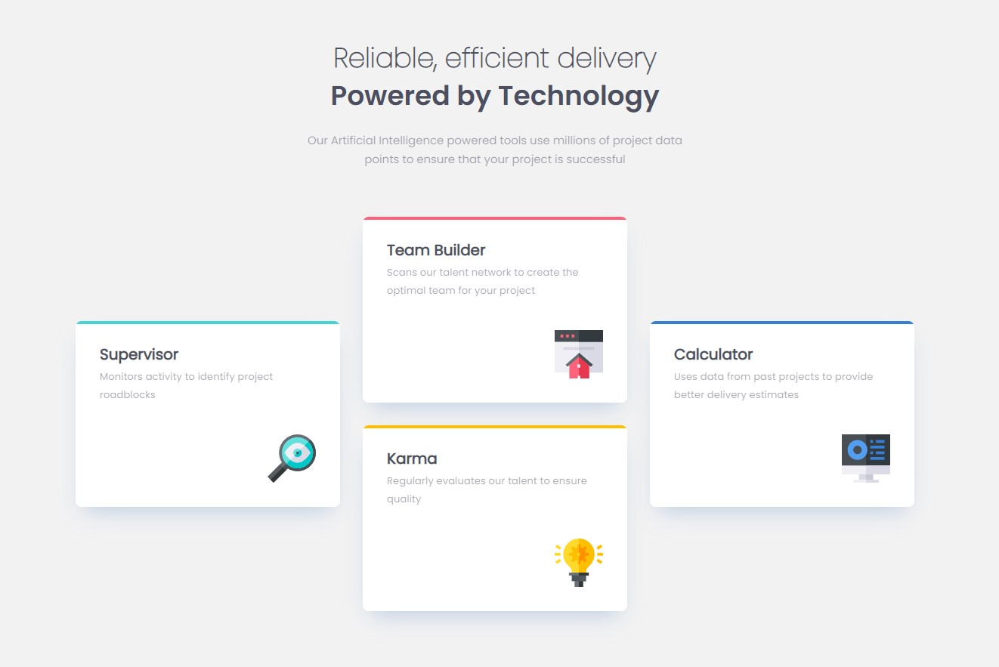

### Screenshot




## My process

### Built with

- Semantic HTML5 markup
- CSS custom properties
- Flexbox
- CSS Grid

### What I learned


```html
<main class="cards">
  <div class="box box1">...
```
```css
.cards {
  display: grid;
  grid-template-columns: repeat(3, 1fr);
  grid-template-rows: repeat(4, 1fr);
  max-width: 1110px;
  gap: 1.875rem;
}
@media (max-width: 768px) {
  .cards {
    display: flex;
    flex-direction: column;
    gap: 1.5625rem;
  }
}
```

## Author
- Frontend Mentor - [@yourusername](https://www.frontendmentor.io/profile/frontend-en)
